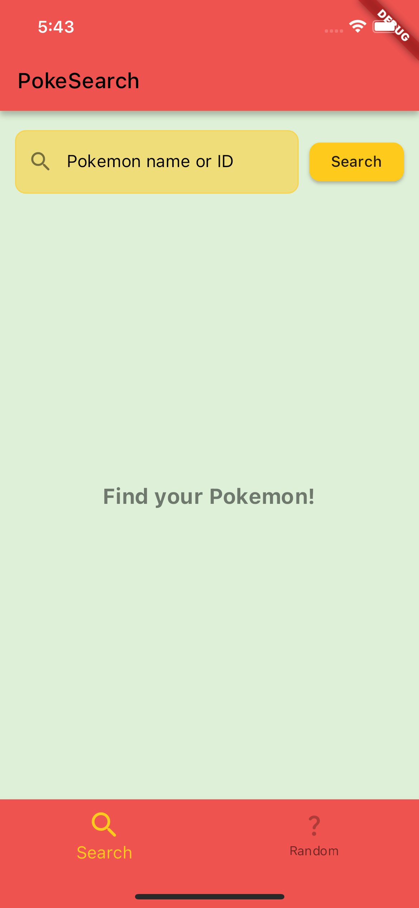
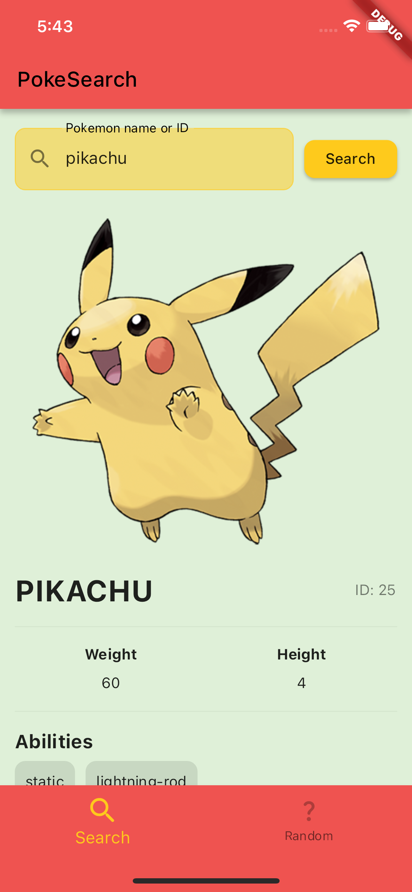
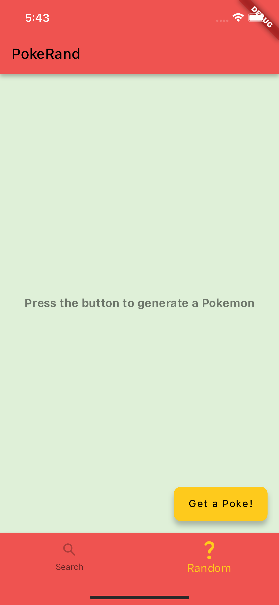
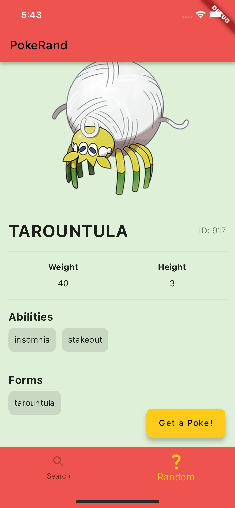

# PokeAPI test task

A Flutter app for [PokeAPI](https://pokeapi.co/) requests.\
The app allows to find a pokemon by it's name or id and get a random one.

## Stack
- Flutter BLoC
- SQFlite
- http

## Screens:
- Search screen
- Random pokemon screen

## Screenshots

### Splash screen

### Search screen

    
    

### Random pokemon screen

    
    

